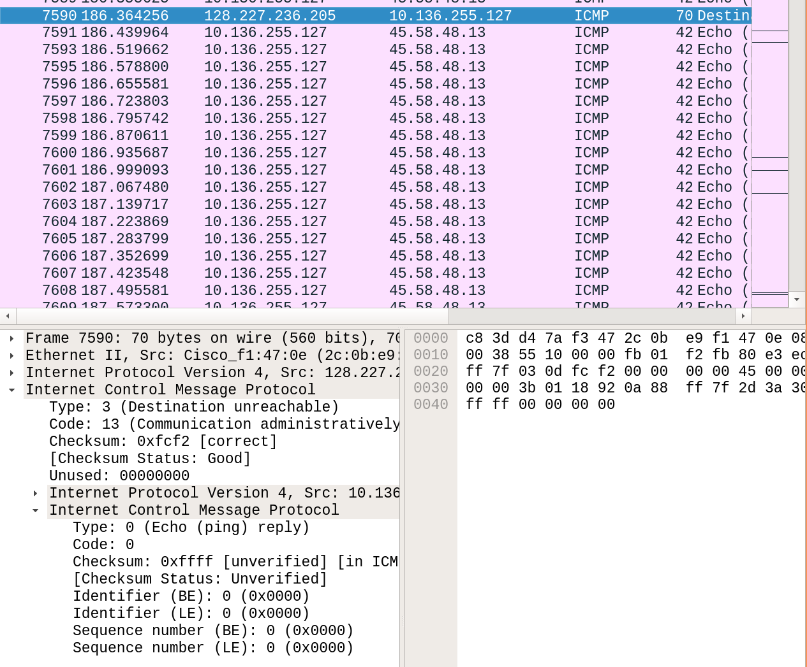
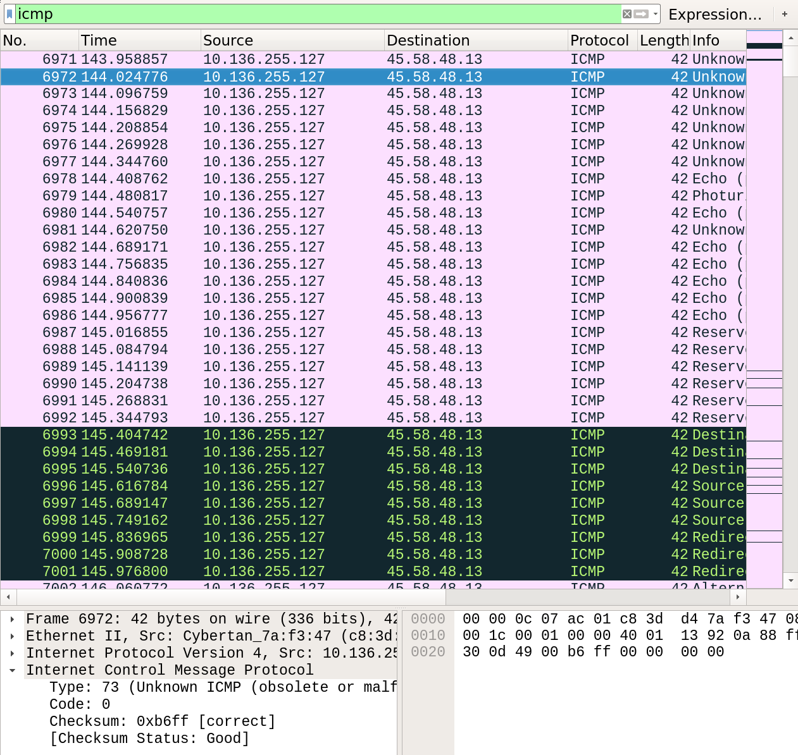
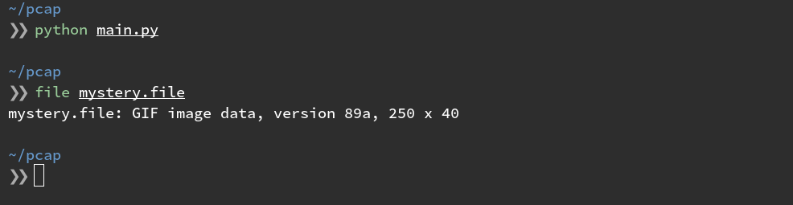

I'm a big fan of learning through competition. Capture The Flag games have tremendous utility for
training within the Security sector and even outside of it. Intentionally vulnerable web
applications, like [OWASP's JuiceShop](https://www.owasp.org/index.php/OWASP_Juice_Shop_Project), 
are excellent tools for assisting in developing Secure Software Development Life-cycle programs
within an organization.

So let's take an exercise I recently came across in a CTF event. The skills required to solve the
challenge are actually quite useful in real-world defensive scenarios.

**Story Time**

You work for the Info Sec team of Acme Co. As part of your security toolset, you've set up an
Intrusion Detection System on a span port in your data center. During a routine Threat Hunting
exercise, your team discovers some anomalous traffic coming from a particular server. Your IDS
says that there was a strange amount of ICMP traffic coming from this machine. You go back to when
the traffic occurred and pull a packet capture during that time-frame and you open it in WireShark.

You scan around and see some normal looking traffic until you spot the flood of ICMP packets.



After filtering for the suspected packet type, you begin to analyze each packet and before long you
notice most of the ICMP packets consist of a `type` that WireShark doesn't recognize. 



This is prime example of _"never fully trust your tools"_. ICMP has a defined 
[set of possible "good" types]
(https://www.iana.org/assignments/icmp-parameters/icmp-parameters.xhtml#icmp-parameters-types).
A legitimate ICMP request should only contain one of these predefined `types`. WireShark is
attempting to map a `type` to a plaintext definition, and failing to do so because these aren't
legitimate ICMP echo requests.

By scanning through the `type` flags of a few successive packets, we begin to suspect that these
values might be ASCII codes, given the lower/upper bounds. If we manually take the first 3 codes
`(71, 73, 70)` and convert them, we get:

```sh
for num in 71 73 70; do 
  ascii="$(printf '%03o' $num)"
  printf "\\${ascii}"
done

> GIF
```

It appears we have a GIF file header in some ICMP traffic. Strange indeed.  At this point, we
decide that switching to a programatic approach might be easier. Python's `scapy` library is a handy
packet parsing tool I've used in the past.

Let's fire up the iPython REPL and import our tools:

```python
from scapy.all import IP, ICMP, rdpcap
pcap = rdpcap('data.pcap')
```

We're going to want to filter out all of our ICMP packets:

```python
packets = [p for p in pcap if ICMP in p]
```


Since the values used for the `type` flag span the entire ASCII range, it's a statistical
probability that this ICMP traffic will send a legitimate ICMP echo request. That means we'll get
legitimate responses in our PCAP data. We can isolate requests by specifying that we only want ICMP
packets that are _leaving_ a particular source.

```python 
packets = [p for p in packets if p[IP].src == '10.136.255.127']
```

Now we have a handle on all ICMP traffic leaving 10.136.255.127. The next step is to convert
everything from ASCII codes to their corresponding characters and write to disk.

```python
# take type flag of each packet
ascii = [p[ICMP].type for p in packets]

# convert them to character string
chars = [chr(x) for x in ascii]
data = "".join(chars)

# write the data to a file
with open('mystery.file', 'w') as f:
    f.write(data)
```

What exactly is this file?

```sh
file mystery.file
```



And we have our data. If we want to go back and clean up some of the code and make it somewhat
reusable...

```python
from scapy.all import IP, ICMP, rdpcap

FILE = 'data.pcap'
SOURCE_IP = '10.136.255.127'
PROTO = ICMP


def filter_op(pkt):
    """Filter operation for [PROTO] and [SRC_IP]"""
    return PROTO in pkt and pkt[IP].src == SOURCE_IP

def ascii_convert(pkt):
    """Map function to convert ASCII values to text"""
    return chr(pkt[PROTO].type

server_icmp = filter(filter_op, rdpcap(FILE))
data = map(ascii_convert, server_icmp)

with open('mystery.file', 'w') as f:
    f.write("".join(data))

```

In this example, our packet capture contained a single file, the GIF. Not a likely scenario in a
real-world investigation. If an attacker had initiated an ICMP shell or downloaded multiple files,
it would be difficult to tell where one file ends and another begins. In this example, `binwalk`
could help us extract the multiple files.

To simulate this scenario, add the following line to our script, just before with write-to-disk
operation:

```python
data = data + data + data
```

After running the python file again, we can run the resulting file through binwalk.


Binwalk was able to find 3 distinct files embedded in the dumped data from our script.

[Here's](data.pcap) the PCAP for those playing the home game. Happy hunting.

