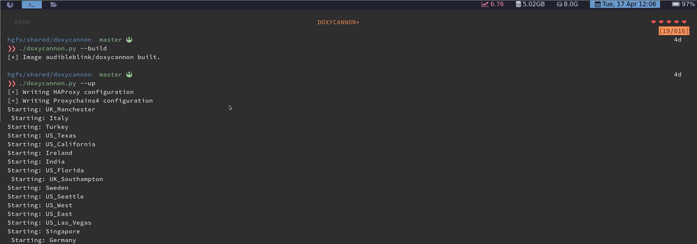
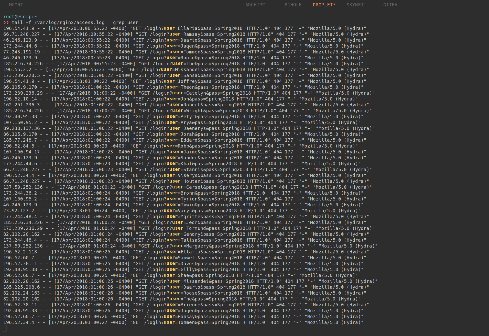
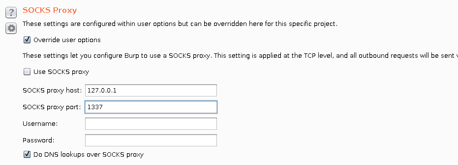
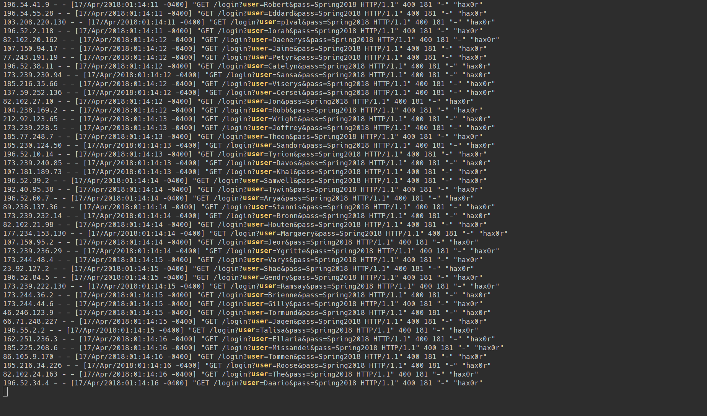

Password sprays are here to stay. It's probably a good idea to configure some clever WAF rules,
implement captcha systems, and set up additional alerting. But once implemented, how do you test and
tune your protective measures?

Enter [DoxyCannon](https://github.com/audibleblink/doxycannon)

DoxyCannon's name borrows from ProxyCannon, a script that instantiates cloud infrastructure through
which one can proxy requests. Unlike ProxyCannon, DoxyCannon gives you the same functionality
without needing to rely on cloud providers. Everything is local. DoxyCannon will use Docker and a
collection of OpenVPN config files to create local proxies on localhost. In combination with tools
like proxychains or DoxyCannon's own DoxyProxy, you can shuffle through local proxies for each
request, masking the true IP of the attacking machine.

Let's see what this looks like on the receiving end. First, let's set up DoxyCannon.

```sh
git clone https://github.com/audibleblink/doxycannon
cd doxycannon
```

We're going to using Private Internet Access as our VPN provider.

```sh
wget  https://www.privateinternetaccess.com/openvpn/openvpn.zip
unzip -d VPN openvpn.zip

# Remove whitespace from the ovpn file names
find . -name *ovpn | rename 's/ /_/g'

# Append `auth.txt` to the `user-pass-auth` directive
sed -i 's/pass/pass auth.txt/' *.ovpn

# Create your auth.txt file
echo "${PIA_USER}\n${PIA_PASS}" > VPN/auth.txt
```

Once everything's been set up, you can build the image and bring up your PIA containers.



At this point, DoxyCannon has dynamically created a `proxychains.conf` file for you in the root of
the project directory:

```
# proxychains.conf
# ------------------------------------------------------------------------
# This file is automatically generated by doxycannon. If you need changes,
# make them to the template string in doxycannon.py
random_chain
quiet_mode
proxy_dns
remote_dns_subnet 224
tcp_read_time_out 15000
tcp_connect_time_out 8000

[ProxyList]
socks5 127.0.0.1 5000
socks5 127.0.0.1 5001
socks5 127.0.0.1 5002
socks5 127.0.0.1 5003
[...snip]
socks5 127.0.0.1 5042
socks5 127.0.0.1 5043
```

If you're using a console application for your spray, you're ready to go:


Here's what our web server access logs look like:



With the `--single` flag, DoxyCannon also has the ability to create a proxy rotator that provides a
single port at which one can point GUI applications.

```sh
# Start DoxyProxy
❯❯ ./doxycannon.py --single
[+] Writing HAProxy configuration
[*] Image doxyproxy built.
[*] Staring single-port mode...
[*] Proxy rotator listening on port 1337. Ctrl-c to quit
```

While DoxyProxy is running, applications like Burp Suite can be configured to use port 1337.
DoxyProxy is just another docker container. It runs HAProxy in a layer 4, round-robin
configuration and binds to the host network.





I'm still adding features to DoxyProxy. Coming up will be the ability to control remote docker
hosts using the official docker sdk. 

