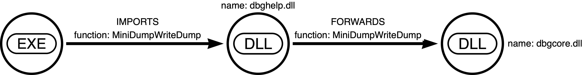
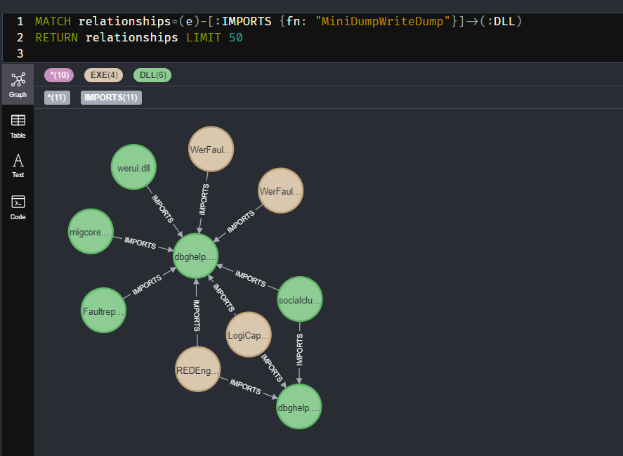
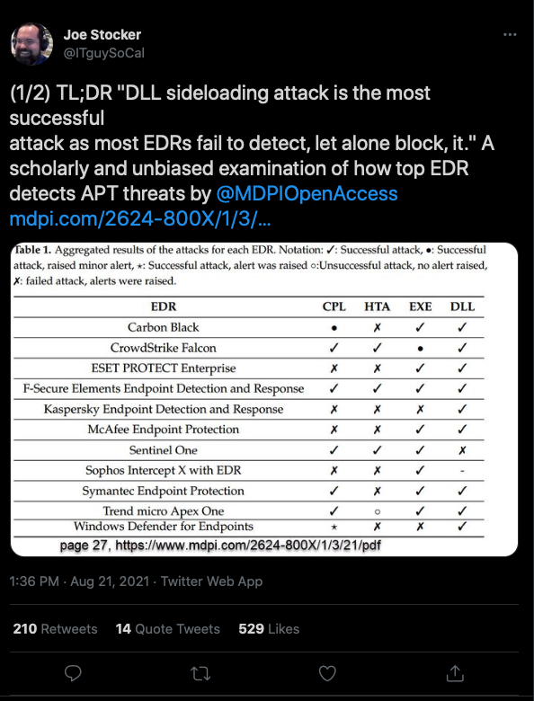
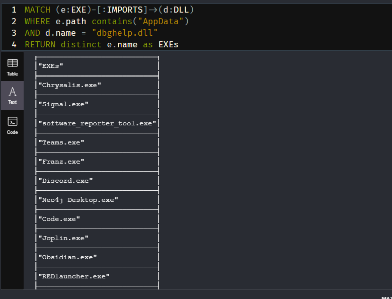
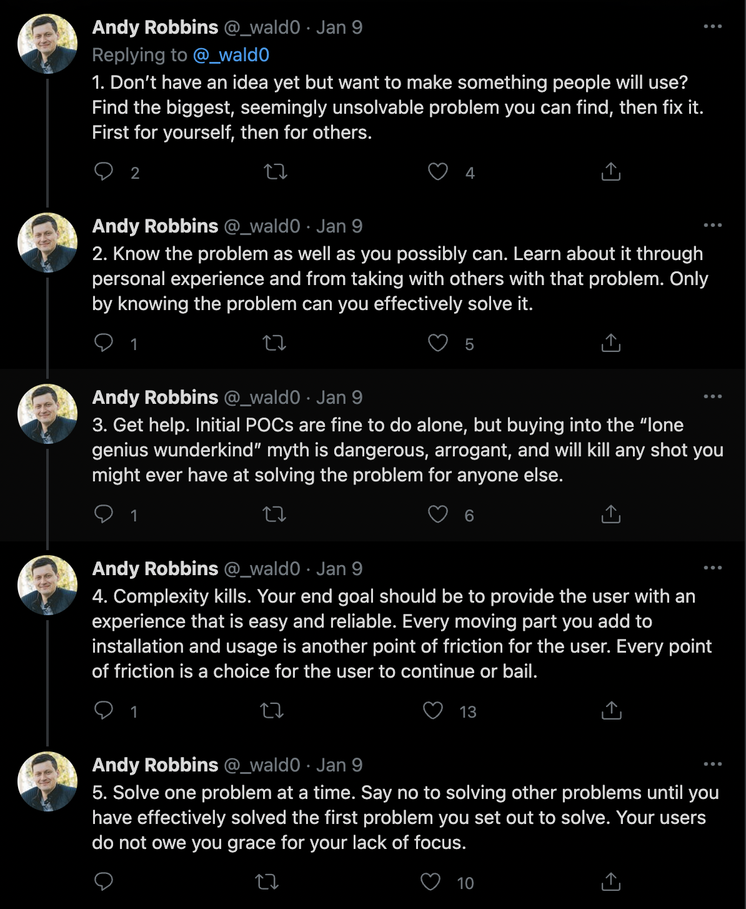
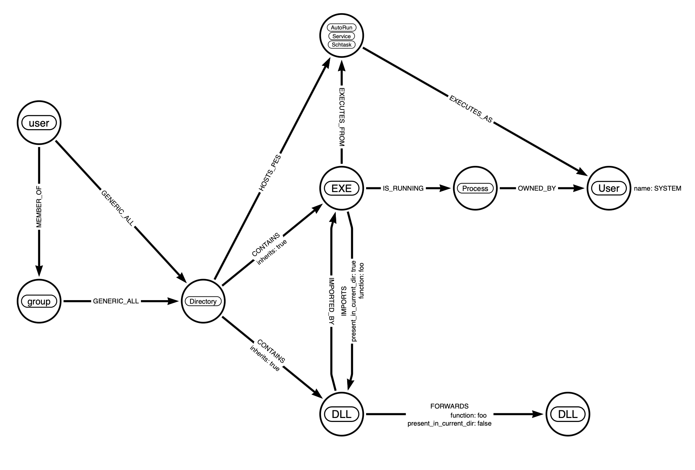

_or Building Your Own Binoculars_

I like this bi-line for a couple of reasons.
- It touches on self-sufficiency in the face of necessity
- It could bring up one of two things
	- You may be too far from the problem to be objective
	- You may not be seeing the forest for the trees. Being an expert on something can make it difficult to have an objective/practical opinion about the downstream effects your specialty has on the world around you.
- Building tools to solve a problem reveals perspectives to problems you did not anticipate 
- I recently finished reading "Paddle Your Own Canoe" by Nick Offerman and wanted a cool title like his

In my research, it often takes me a while to get started because I ~~procrastinate~~ spend too much time building tools to facilitate the research. I try to anticipate my needs. I do my best to ensure a fast feedback loop, allowing fast failures and restarts. Failures are still data.

Some time ago, while hashing out what to build into an application, I received some advice that's helped me in various technical and non-technical aspects of my life:

> Don't anticipate details. Therein lies madness. 
> Instead, only anticipate change, and build what's needed to facilitate that change.

There's your daily does of __Zen and the Art of Motorcycle Maintenance__


## Prior Work

Below is a list of related work I encountered throughout the life-cycle of this project. This would
have been much more painful without you all. Thank you:

- [%appdata% is a mistake](https://redteamer.tips/appdata-is-a-mistake-introducing-invoke-dllclone/): Jean Maes
- [Analysing RPC with Ghidra and neo4j](https://blog.xpnsec.com/analysing-rpc-with-ghidra-neo4j/): Adam Chester aka @_xpn_
- [Automating DLL Hijack Discovery](https://posts.specterops.io/automating-dll-hijack-discovery-81c4295904b0): Justin Bui aka @slyd0g
- [Using Slack, WhatsApp (electron Apps) for malware attack](https://firefistace153.medium.com/using-slack-whatsapp-electron-apps-for-malware-attack-5b5b40efba2c)


## Initial Threads
I've been wanting to strengthen my Threat Intelligence and Malware Reversing chops, so I picked up [Malware Data Science](https://nostarch.com/malwaredatascience) by Joshua Saxe with Hillary Sanders. There's a section about inferring the intent of malware based on its dependencies. Thread 1. 

Thread 2: I had been playing with Google's project dependency mapper, [deps.dev](https://deps.dev). It's pretty wild seeing the relationships between all these different OSS projects graphed out in such a visually impactful way. During the Great Left-Pad debacle in the node.js ecosystem, their community caught a lot of snark for its tendency to pull in dependencies for seemingly trivial tasks.

> [Is-Even](https://www.npmjs.com/package/is-even), which does exactly what you're thinking and nothing more, is downloaded 200k times a week

When a developer of a popular package deleted it from NPM, new attempts to rebuild projects that depended on it would simply fail to build. 

> A note on Left Pad: If you know what this was, skip ahead. 
> Left-Pad was a node.js package that would take an input, and pad it with whatever you wanted on the left side, as many times as you wanted. If you passed it 1234, and the number 0 for the padding, and the number 8, for the desired total length, it would return 00001234. 
> It turns out some very big projects imported this dependency. Sometimes not even directly! It was an indirect dependency, meaning it was a dependency of a dependency of a dependency... etc. One such project was React.js. All over the world developers ran into failures, CI pipelines failed to deploy, and many hours (and dollars) were lost that day. 

Was the snark justified? I mean, how new was this problem of dependency hell?

## Threads.Join

Since any good experiment begins with a question: 

- If we knew all the direct and indirect dependencies on a Windows system:
	- Could we find "lolbins" in the form of imported dependencies?
	- How quickly could we analyze the blast radius if it became known that a particular dependency had a vulnerability
	- In knowing what processes would have what loaded functions by default, could we make those processes do things they wouldn't normally do and would anyone be able to tell?

In order to collect the data, I needed a way to quickly pull dependencies from all PEs on disk. 
> PE stands for Portable Executable. Their structure follows a predefined set of rules, or specifications. EXEs and DLLs are both PEs. 

I also knew I wanted get a visual representation of these dependencies. My thought was to create something that would allow for the easy ingestion of data into Neo4j, a graph database. You may be familiar with this if you've ever used Bloodhound.

Wanting to be able to test a single PE from any OS, and to also have a portable tool I can use on many different versions of fresh Windows installs, I chose Golang and I built `ino` - https://github.com/audibleblink/ino/tree/v0.0.1

Being new to the PE format, I discovered a few things at this point in my journey:
- PE files can import other PEs, regardless of extension
	- EXEs can import DLLs
	- DLLs can import DLLs
	- DLLs can import EXEs
	- EXEs can import EXEs
	- Both can export functions
- PE files have Forwards
	- A PE can Export a function that it itself does not define
	- It's a form of Export that merely points to a different DLL's export

To `ino`, I added the ability to collect Forwards as well. I also added the ability for `ino` itself to recursively search for PEs, given a starting directory. This brings us to v0.1.2 - https://github.com/audibleblink/ino/tree/v0.1.2

### The Data:

Collection of the data:

```bash
$ ino.exe -dir c:\ -type dll > dlls.json
```

Resulting JSON:

```json
ino -v comsvcs.dll

{
  "Name": "comsvcs.dll",
  "Path": "C:\Windows\system32",
  "Imphash": "...",
  "Imports": [...],
  "Exports": [...],
  "Forwards": [...],
  "PDB": "...",
  "Sections": [...],
}
```

With the data collected from about 86K PEs on a fresh install of Windows, I moved on to importing to and visualizing with Neo4j.

## First Round of Analysis

Neo4j is a graph database that surfaces relationships between pieces of data. You may be familiar with traditional databases that hold mass amounts of information and correlate separate tables with Joins. While Neo can hold data for each table row (aka Node in Neo-speak), it's purpose is to shine a light on the "Joins". It's an oversimplification, but if you were unfamiliar with Neo4j before this article, knowing that should get you through the rest of this part.

A lot of its power comes from not needing to know any intermediary nodes in order to surface relationships. You simply ask it, "What's the shortest path between Node A and Node B?". If ever there was a way to find exactly just how many degrees you're separated from Kevin Bacon, this is it. 

### The Model:



> Fail log: I should have created the graph schema first. By starting with the tool first, I was influenced in how I though about the graph. In retrospect, the Function name should have been its own node. Thanks to some very helpful conversations with Andy Robbins aka @wald0, I learned that anything you'll want to search by should be a node and not a property on that node or edge.  Otherwise, it increases query time substantially.

> Something like this would have been a more useful model:
```
> (EXE)-[:IMPORTS]-(:FUNCTION)-[:DEFINED_BY]-(DLL)-[:FORWARDS]-(FUNCTION)
```

and the ingestion:

```cypher
CALL apoc.load.json("file:///sys32_dll.json") 
YIELD value AS dllData
MERGE (dll:DLL {name: dllData.Name, complete: false})
SET dll.exports = dllData.Exports
SET dll.path = dllData.Path
SET dll.imphash = dllData.ImpHash
SET dll.complete =  true

WITH dll, dllData UNWIND dllData.Imports AS import
MERGE (dll1:DLL {name: import.Host})
FOREACH (i in CASE WHEN dll1.complete THEN [] ELSE [1] END |
	SET dll1.complete = false)
WITH dll, dll1, import, dllData UNWIND import.Functions as func
MERGE (dll)-[:IMPORTS {fn: func}]->(dll1)

WITH dll, dllData UNWIND dllData.Forwards AS fwd
MERGE (dll3:DLL {name: fwd.Host})
FOREACH (i in CASE WHEN dll3.complete THEN [] ELSE [1] END |
	SET dll3.complete = false)
WITH dll, dll3, fwd UNWIND fwd.Functions as func
MERGE (dll)-[:FORWARDS {fn: func}]->(dll3)
```


The ingestion was intense and took me several hours of trial and error to build. And this was a relatively simple model. Let's explain this query a chunk at a time. 

> Reminder: This post chronicles the linear progress of this project, errors and all. In other words, this doesn't work =P.

- `apoc.load.json() yeild value as dllData` will import some JSON, iterate through the lines, giving you access to each as the variable `dllData`
	- `dllData` is the JSON from a few lines up
- `MERGE (dll:DLL {...}` will attempt to find, and if not found, creates a DLL node with the included properties
	- `complete` indicates if this DLL has been processed because it was one of the JSON line. I set it to true in 4 lines, because if it's running through this loop, it is a JSON object
	- This script adhoc creates other PE nodes when iterating through Imports and Forwards. In that data, the properties `exports, path, imphash` are not present
		- In those cases, somewhere down the line I may run into that actual location of those adhoc nodes. I want to find them, instead of creating new ones
- `WITH dll, dllData UNWIND dllData.Imports AS import` - sets up an iteration the `imports` array, while giving us access to the `dll, dllData` variables.
- `MERGE ()` - Find or create this node which is an import of our top-level node. The one we're currently iterating through from our JSON.
- `FOREACH ...` - Neo doesn't have IF/ELSE conditions, so this little hack uses the `complete` flag to determine whether or not this a complete node or an adhoc one, with incomplete information. If it's incomplete, we set the `false` flag
- `WITH dll, dll3, fwd UNWIND fwd.Functions as func` - another loop to create the relationship between our top-level DLL and the current iteration of the `Imports` array
	- `MERGE (dll)-[:IMPORTS {fn: func}]->(dll1)`
- The next section repeats this logic, but for Forwards

> Fail log: Don't do this ^. It's error-prone and slow to seed. Instead focus on
> creating the nodes first, then as a post-processing step, create the relationships. 
> An example:  

```cypher
CALL apoc.periodic.iterate(
				"MATCH (node:%s),(dir:Directory) WHERE node.parent = dir.path RETURN node,dir",
				"MERGE (dir)-[:CONTAINS]->(node)",
				{batchSize:1000, parallel: true})
```
> 	Arg 1: find related nodes with a query,   
> 	Arg 2: action to take on each returned "row"  
> 	Arg 3: go really fast  

### Visualization

Now we're getting to the fun part. With all nodes and relationships set, we can begin exploring.

Due to some other recent but unrelated work, I had a particular interest in anyone who imports `dbghelp.dll!MiniDumpWriteDump`. 



> Fail log: My logic for not creating duplicates didn't even work. lol

What are some other queries we can run?
- Show me all DLLs with a FORWARD
- Who imports a particular DLL?
- Who imports a particular Function?
- Show me all DLLs imported by a certain EXE

It was around this time a [report comparing different EDRs](https://mdpi.com/2624-800X/1/3/21/pdf) was making the rounds. Results indicated that executions via DLL loads were harder to catch. 



If we're just talking execution (or persistence), and not privilege escalation, where are there programs installed that run regularly and whose directories are probably writable? %APPDATA%.

Let's continue playing with `dbghelp` Given we have a `Path` attribute where every PE is located...




**very interesting**

Out of all the EXEs in APPDATA, why these? With the exception of maybe 2, I noticed that they're all Electron apps.

Let me pause here and say, that the Dll path search order in Windows is indeed a feature. This isn't very exciting or new. At best we have code execution or persistence. Teams.exe may be worth noting,
since it's signed by Microsoft. The interesting part here, I think, is for long haul, objective-based Red Team engagements. Red Teams aren't in a hurry to exploit the world. Depending on the objective, gathering information which leads to objectives is the goal. I'll be honest, Red Teaming can sometimes be down-right boring. Sometimes it's kicking in (metaphorical) doors but sometimes it's just a stakeout. 

I googled around for similar research to see if anyone had beaten me to the punch. 

These 2 results came back as relevant:

- [Using Slack, WhatsApp (electron Apps) for malware attack](https://firefistace153.medium.com/using-slack-whatsapp-electron-apps-for-malware-attack-5b5b40efba2c)
- This [issue](https://github.com/electron/electron/issues/28384) on Electron's GitHub Repo.

The first one details the hijacking I've covered, and the author goes on to PoC the planting of the DLL with a maldoc.

The second is a Github Issue from March 2021, listing even more DLLs than what I found with static analysis. I fired up Procmon, and sure enough, many of these are lazy-loaded, thus not existing in the Import Address Table.


## Conclusion

By mapping out relationships of PEs and their dependencies, we've discovered a universal way to load code into any Electron app, of which there are thousands. The possibilities are exciting when you begin to consider what kind of data is handled by certain Electron apps with which you now get to share memory address space with.

This first go has reminded me of the importance of patience in scoping and defining your work. It keeps it targeted and on track. It can also prevent you from having to restart over and over again.
Taking a little extra time up front to to model data, structure tasks, pulling in outside help earlier, these are all things that can ensure your project flows a little smoother and linearly.

Learning by doing is great, but humans have the capacity to learn from the mistakes of others. We should use that gift more. The trick is finding a happy medium between structure and tangents. Awesome
discoveries often from tangents. 

But a plethora of information creates a poverty of attention. 

A relevant thread I wish had come before starting:




So at this point, I think I've reached the end of this particular data-set's utility.

After satisfying the occasional curiosity of "who imports/forwards what", 
I've pivoted to something that hopefully is more impactful.

## What's Next

A new thread: 

How common are second-order DLL hijacks? Where you can't hijack a DLL because the imported DLL
exists within the same directory as the EXE, but that DLL contains a forward to a DLL that
_doesn't_ exists in the same directory. 

Can I write in that directory?

How many of those EXEs are run with high privileges?

I'm currently shaking that tree and I hope to have that blog written up soon. Here's a preview.

<a href="4.png">  </a>

<meta name="description" content="Accidentally Graphing DLL Hijacks in Every Electron App            ">

<!-- Facebook Meta Tags -->
<meta property="og:url" content="https://sec.alexflor.es/posts/2022/01/accidentally-graphing-dll-hijacks-in-every-electron-app/">
<meta property="og:type" content="website">
<meta property="og:title" content="Building Your Own Binoculars">
<meta property="og:description" content="Accidentally Graphing DLL Hijacks in Every Electron App            ">
<meta property="og:image" content="https://sec.alexflor.es/posts/2022/01/accidentally-graphing-dll-hijacks-in-every-electron-app/4.png">

<!-- Twitter Meta Tags -->
<meta name="twitter:card" content="summary_large_image">
<meta property="twitter:domain" content="sec.alexflor.es">
<meta property="twitter:url" content="https://sec.alexflor.es/posts/2022/01/accidentally-graphing-dll-hijacks-in-every-electron-app/">
<meta name="twitter:title" content="Building Your Own Binoculars">
<meta name="twitter:description" content="Accidentally Graphing DLL Hijacks in Every Electron App            ">
<meta name="twitter:image" content="https://sec.alexflor.es/posts/2022/01/accidentally-graphing-dll-hijacks-in-every-electron-app/4.png">

