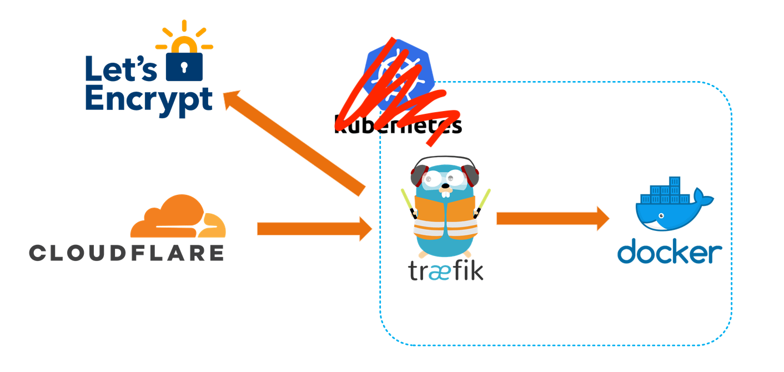

---

**It calls to you.** Your drawer of misfit toys and abandoned projects.

Every few months, I come back to the world of SoCs to see what's new, but nothing
ever really sticks around long enough for it to be considered useful enough to be permanent. 

- Smart mirrors
- [Twitter bots that shame you](https://twitter.com/thirstyplant1) for not watering
your plants
- Video Game emulators
- Home control devices
- The occasional GPIO project to manipulate things in MeatSpace

The only exception is probably an ad-blocking DNS server, the Pi-Hole. But even that's been
graduated to running as distributed Linux Containers ([LXC](https://linuxcontainers.org))

All that said, this project is also probably drawer-bound, but at least it was fun!

## The ClusterHAT


> https://www.sparkfun.com/products/18155

The ClusterHAT sits atop a traditional Raspberry Pi, aka a HAT (Hardware Attached on Top. Yes,
really). It has slots for you to insert 4 Raspberry Pi Zeros. When Gadget Mode is enabled, and
the Zeros attach to the HAT, they become their own little subnet, branching off the main Pi. 

> Gadget Mode enables networking over USB

If comparing to a traditional network setup, we might think of the HAT like a network switch.
When you combine the HAT with the modified Raspbian ISOs provided by [8086](https://www.8086.net),
in a couple of minutes you have a little cluster of Pis, ready to do your bidding. 

### Setup

The instruction over at https://clusterhat.com/setup-overview are pretty clear, but in summary:

- The main Pi has its own ISO, which comes in two flavors:
  -   CNAT - Pi Zeros are served IPs from the main Pi in the 172.19.181/24 range
  -   CBRIDGE - All 5 Pis are on the same network as you
- Pi Zeros get there own corresponding, numbered ISO
  - Pi #1 gets ISO P1, and is assigned 172.18.181.1 
    - _if using the CNAT image_
  - Pi #2 gets ISO P2, and is assigned 172.18.181.2 
  - and so on

[You _can_ netboot](https://8086.support/index.php?action=faq&cat=23&id=97&artlang=en) 
all of the Zeros from the main Pi's, but keep in mind you'd be sharing a single sdcard between 5
operating systems. It's cool to see, if you have the time, but it might not be an ideal long term
solution. `apt upgrade` on 5 nodes took about an hour. YMMV since sdcards come in a variety of
speeds. 

[Netboot instructions here](https://8086.support/content/23/97/en/how-do-i-boot-pi-zeros-without-sd-cards-cluster-hat_cluster-ctrl.html)

Once all the sdcards are flashed, (or netboot shares copied), make sure to `touch /boot/ssh` on
each node to enable remote access. 


### Connecting to the Pis

Place your Zeros in the ClusterHat's ports and attach the ClusterHat to the main Pi.

Boot up the main Pi, SSH in, and supply power to the Zeros with:

```
clusterctrl up p{1,2,3,4}
```

  
Let's talk about the CNAT image. The Zeros aren't directly accessible from your main LAN. Instead
of SSHing to the main Pi, then SSHing again to each Zero, we can simplify the process by
setting the main Pi, which _is_ on your direct physical network, as an SSH ProxyJump.

In your ~/.ssh/config file, put in the following, with modifications for your hostnames and IPs, of
course:

```hcl
Host *.chappa.ai
  ProxyJump hammond
  User Pi

Host hammond.chappa.ai
    HostName 192.168.42.10

Host oneil.chappa.ai
    HostName 172.19.181.1

Host carter.chappa.ai
    HostName 172.19.181.2

Host tealc.chappa.ai
    HostName 172.19.181.3

Host danieljackson.chappa.ai
    HostName 172.19.181.4
```

You can then copy your ssh public key to each host with:

```bash
for name in {hammond,oneil,carter,tealc,danieljackson}.chappa.ai ; do
  ssh-copy-id -i ~/.ssh/id_ed25519 "${name}"
done
```

Enter your passwords and you should now be set up for password-less ssh, which we'll need later to
continue installing Docker on each node with Ansible.


On each Pi, run through the menu at `sudo raspi-config`. Spend as much or as little time as you
want here. I usually just go with:


1. System Options
  - change password
  - change hostname
4. Performance Options
  - reduce gpu memory to 16
6. Advance Options
  - expand memory card

## Docker Prep With Ansible

Raspberry Pis need to have some options enabled before containers are able to run. 

Later, we'll append to their `/boot/cmdline.txt` the following:

```hcl
cgroup_memory=1 cgroup_enable=memory cgroup_enable=cpuset
```

This tells the kernel to allow the use of `cgroups`, or "control groups". Docker containers are just
a scoped set of process and resources on your computer. Containers were around long before Docker,
which made the use of Linux Namespaces and CGroups more accessible. 


### A Small Tangent on Containers

> Containers are logical units of Linux kernel features, distributed as tarballs, whose processes
> are anchored to namespaces and controlled by CGroups.

#### Why are Namespaces

To create a Namespace for a process, additional flags must be passed to process-creation syscalls.
These additional flags can restrict what this process can see and what other processes can see
about it

**Other things you can namespace**
- Hostnames
- Process IDs
- Filesystems
- IPC
- Networking
- User IDs

#### Why are CGroups

At its most basic? They allow you to control, audit, and limit how your system's resources are
accessed or used.

- **Resource limiting** Groups can be set to not exceed a configured memory limit
- **Prioritization** Some groups may get a larger share of CPU or disk I/O
- **Accounting** Measures a group's resource usage
- **Control** Freezing groups of processes

What sorts of things can we control?

- Memory: `/sys/fs/cgroup/memory`
- CPU/Cores `/sys/fs/cgroup/cpu*`
- I/O `/sys/fs/cgroup/blkio`
- Processes `/sys/fs/cgroup/cgroup.procs`
- Devices `/sys/fs/cgroup/devices.*`


### Automating Setup

If we're interested in following along, all the playbooks can be found here:
https://github.com/audibleblink/clusterctrl-ansible/

First, we'll need to setup our inventory file and name our groups. Below is one possible
configuration.

```toml
# file: inventory.ini
[clusterctrl_server]
hammond


[clusterctrl_nodes]
oneil
carter
tealc
danieljackson


[clusterctrl:children]
clusterctrl_server
clusterctrl_nodes

```

If you'd like, create an `ansible.cfg` to save a couple keystrokes when calling `ansible-playbook`.
Otherwise you'd need to specify an inventory file each time.

```ini
[defaults]
inventory = ./inventory.ini
interpreter_python = /usr/bin/python3
```

The following task ensures, in an idempotent way, that our kernel flags exist on all our Pis, and
reboots the Pi if the flags weren't already there.

```yml
---

- name: Enable container features
  become: true
  register: containers_enabled
  replace:
    path: /boot/cmdline.txt
    regexp: '^([\w](?!.*\b{{ item }}\b).*)$'
    replace: '\1 {{ item }}'
  with_items:
  - "cgroup_enable=cpuset"
  - "cgroup_memory=1"
  - "cgroup_enable=memory"


- name: Reboot after enabling containers
  become: true
  when: containers_enabled.changed
  reboot:
```


Here we ensure all necessary packages, GPG keys, and repos are present before installing
`docker-ce`


```yml
---

- name: Install Docker Prereqs
  become: true
  apt:
    package: "{{ packages }}"
    state: present

- name: Add Docker GPG apt Key
  become: true
  apt_key:
    url: "{{ gpg_key_url }}"
    state: present
    keyring: "{{ gpg_key_out }}"

- name: Add Docker Repository
  become: true
  apt_repository:
    repo: "deb [arch={{arch}} signed-by={{ gpg_key_out }}] {{ repo_url }}  {{ release }} stable"
    state: present

- name: Update apt and install docker-ce
  become: true
  apt:
    package: "{{ docker_packages }}"
    state: latest
    update_cache: yes
```

An example of a variable file that needs to exist for the code above to work looks like:

```yml

# docker installation prerequisites
packages:
  - apt-transport-https
  - ca-certificates
  - curl
  - gnupg
  - lsb-release

# docker repo gpg key location
gpg_key_url: https://download.docker.com/linux/raspbian/gpg

# outfile on local disk for docker repo gpg key
gpg_key_out: /usr/share/keyrings/docker-archive-keyring.gpg

# components for genreating the `deb` line being added to `/etc/apt/sources.list.d`
repo_url: https://download.docker.com/linux/raspbian
release: buster
arch: armhf

# installing docker
docker_packages:
  - docker-ce 
  - docker-ce-cli 
  - containerd.io
```

#### Folder Structure

All of the tasks can live in a single playbook, we don't need to over complicate things and use
the folder hierarchy that Ansible Docs recommend for managing big fleets.

...

But we're gonna anyways. 

```
├── ansible.cfg
├── clusterctrl.yml
├── inventory.list
├── roles
│   ├── clusterctrl
│   │   ├── tasks
│   │   │   ├── main.yml
│   │   │   ├── apt_upgrade.yml
│   │   │   ├── ensure_aptitude.yml
│   │   │   ├── enable_containers.yml
│   │   │   ├── install_docker.yml
│   │   │   ├── docker_group_add.yml
│   │   │   └── swarm_init.yml
│   │   ├── vars
│   │   │   └── main.yml

```

Both simple and hierarchical methods are available here.  https://github.com/audibleblink/clusterctrl-ansible/

> _Why even talk about the folder structure then?_  
> Porque no los dos?

Some may already have an Ansible repo and most likely have playbooks to manage updates, upgrades,
and user management so it might not make sense to keep those tasks in a single-file play.
Sharing it in this form makes it a bit easier to incorporate to existing Ansible setups. Also, if
someone's just starting their Ansible repo, perhaps this could serve as a starting skeleton

---

__Back to the Pis__

Once all Pis are up and playbooks intact, run:

```sh
ansible-playbook clusterctrl.yml
```


## Docker Swarm Init

It is possible to both initialize and populate the Swarm with an Ansible play, but it requires some
more setup and the use of plugins. We'll meet in the middle though, and still use Ansible to run the commands
remotely instead of ssh-ing to each. (although that is what's happening in Ansible's background
anyway)


Because of our `inventory.list` config file in the current directory, on the main Pi, we can run:

```bash
ansible clusterctrl_server -a "docker swarm init --advertise-addr 172.19.181.254"

# If we didn't have that config file, we'd need to tell `ansibile` where to find our inventory file.
ansible -i /path/to/inventory clusterctrl_server -a "docker swarm init --advertise-addr 172.19.181.254"

```

The `172` IP is for the internal network interface that the Pi Zeros attach to.

We should get an output that includes a line that looks like this:

```
docker swarm join \
  --token SWMTKM-1-1y1rdnp7zjcj2vfw7mkhwzrwizqzixzffmoz4wew1brs0vlnh7-4axlaf1luquyxdgdq6gp3jalr \
  172.19.181.254:2377
```

Let's run that command on each node like this:

```bash
ansible clusterctrl_nodes -a "docker swarm join --token SWMTKM-1-1y1rdnp7zjcj2vfw7mkhwzrwizqzixzffmoz4wew1brs0vlnh7-4axlaf1luquyxdgdq6gp3jalr 172.19.181.254:2377"
```


Hopefully our output looks like:

```bash
❯❯ ansible clusterctrl_nodes -a "docker swarm join --token SWMTKN-1-5lyx690gdzra3jw0ijeuug2sifezuohhb51sk6qw00n8dulebq-23l27nw3oxjh2591shgyncp39 172.19.181.254:2377"

carter | CHANGED | rc=0 >>
This node joined a swarm as a worker.
danieljackson | CHANGED | rc=0 >>
This node joined a swarm as a worker.
oneil | CHANGED | rc=0 >>
This node joined a swarm as a worker.
tealc | CHANGED | rc=0 >>
This node joined a swarm as a worker.
```

View your new Swarm Cluster with:
```bash
pi@hammond:~ $ docker node ls
ID                            HOSTNAME        STATUS    AVAILABILITY   MANAGER STATUS   ENGINE VERSION
o4i5q6yu4r3cc01t3nhcvv6nv *   hammond         Ready     Active         Leader           20.10.9
8f4k7jlwlfx60x0aadmjbn350     oneil           Ready     Active                          20.10.9
lpqd72inz9vooxgidyc14o7l6     carter          Ready     Active                          20.10.9
bhbwbtcyaw56oxzvb3hnawr5y     tealc           Ready     Active                          20.10.9
hxplragfdecau0x464s8jf5s9     danieljackson   Ready     Active                          20.10.9
```

## Deploying Our First Workload

With our cluster ready to receive commands, let's deploy [code-server](https://hub.docker.com/r/linuxserver/code-server)
behind the dynamic reverse proxy, Traefik. We'll configure Traefik to also assign valid TLS certs
for our internal network, without having to expose anything to the broader internet by using the
cloudflare DNS challenge functionality build into Traefik.

If you already own a domain name, create/use a cloudflare account and switch the DNS server in
your registrar settings to cloudflare's servers. Then create API tokens for just that DNS zone.
We'll plug it into Traefik so it knows to how to answer DNS challenges from Let's Encrypt.

The service definition for Swarm looks like this.

```yaml
---
version: "3.8"

networks:
  proxy:
    external: true

secrets:
  cf_token:
    external: true

services:

  traefik:
    image: "traefik:latest"
    secrets:
      - cf_token
    environment:
      - CF_API_EMAIL=sg1@sgc.gov
      - CF_DNS_API_TOKEN_FILE=/run/secrets/cf_token

    command: >
      --api.dashboard=true
      --api.insecure=true
      --providers.docker.swarmmode=true
      --providers.docker.exposedbydefault=false
      --providers.docker.network=proxy
      --providers.file.filename=/traefik_provider.yml
      --providers.file.watch=true
      --entrypoints.web.address=":80"
      --entrypoints.web.http.redirections.entrypoint.to=websecure
      --entrypoints.websecure.address=":443"
      --entrypoints.websecure.http.tls.certresolver=cloudflare
      --entrypoints.websecure.http.tls.domains[0].main=chappa.ai
      --entrypoints.websecure.http.tls.domains[0].sans=*.chappa.ai
      --serverstransport.insecureskipverify=true
      --certificatesresolvers.cloudflare.acme.email=sg1@sgc.gov
      --certificatesresolvers.cloudflare.acme.dnschallenge.provider=cloudflare
      --certificatesresolvers.cloudflare.acme.dnschallenge.resolvers=1.1.1.1:53
      --certificatesresolvers.cloudflare.acme.storage=/config/acme.json

    networks:
      - proxy

    ports:
      - 80:80
      - 443:443

    volumes:
      - "/var/run/docker.sock:/var/run/docker.sock:ro"
      - "appdata:/config"

    deploy:

      placement:
        constraints:
          - "node.role == manager"

      labels:
        - "traefik.enable=true"
        - "traefik.docker.network=proxy"

        - "traefik.http.routers.api.entrypoints=websecure"
        - "traefik.http.routers.api.tls=true"
        - "traefik.http.routers.api.rule=Host(`traefik.chappa.ai`)"
        - "traefik.http.routers.api.service=api@internal"
        - "traefik.http.services.api.loadbalancer.server.port=8080"

volumes:
  appdata:
    driver_opts:
      type: "cifs"
      o: "username=docker,password=swarm,vers=3.0,uid=1000,gid=1000,rw,umask=0177"
      device: "//YOUR_NAS_IP/configs/swarm/traefik"
```

A couple notes:
- This config uses Swarm's Secrets functionality. You create them with `docker secret create`, then
    reference them in your service definition.
    - You can also set the `CF_DNS_API_TOKEN` environment variable manually. The `_FILE` suffix on
        the enivronment variable above is a Swarm-ism so you can use files as string inputs
- It uses a Volume, which is an SMB share elsewhere on the network, in order to store persistent
    data. This is where we'll save the `acme.json` file that Traefik gets from cloudflare. 
- It also enables the Traefik dashboard and API. Useful for getting an overview of everything
    deployed through Traefik, but should be disabled if public facing or when not troubleshooting.
- Traefik can use many different certificate resolvers, cloudflare is just one of many.
- Since Traefik is the ingress for the whole cluster, it is scoped to only be deployed on the
    manager node (hammond, in this case)
- Whenever you see `external: true` in Swarm docker-compose files, that means the resource already exists in the
    swarm. You'll see that `secrets` and `network` both have this key/value. Before deploying this
    service, `docker network create -d overlay proxy`
- Notice the `umask` in the volumes block. The eventual `acme.json` needs to have `0600`
    permissions in order for Traefik to read it in the future. It will complain about the
    permissions being overly-permissive and won't use the certs when you browse to your services.

When ready, from your server node run:
```sh
docker stack deploy -c docker-compose.yml
```

This should spin up your Traefik container. Once you attempt to access it at
`https://traefik.chappa.ai` for the first time, Traefik will conduct the challenge/response dance
necessary to grant you certificates to `chappa.ai` and a wildcard cert at `*.chappa.ai` (previously
configured in the service definition above)


Finally, lets deploy code-server, which is VSCode in a browser. Handy for editing things from any
computer, or remote dev on Linux.


```yaml
---
version: "3"

networks:
  proxy:
    external: true

services:

  code:
    image: linuxserver/code-server:arm32v7-latest
    environment:
      - PUID=1000
      - PGID=1000
      - TZ=America/New_York
      - PROXY_DOMAIN=code.chappa.ai
      - PASSWORD=password #optional
      - SUDO_PASSWORD=password #optional
      # - HASHED_PASSWORD= #optional
      # - SUDO_PASSWORD_HASH= #optional

    networks:
      - proxy

    volumes:
      - "appdata:/config"

    ports:
      - "8443:8443"

    deploy:

      placement:
        constraints:
          - "node.role == manager"
      labels:
        - "traefik.enable=true"
        - "traefik.docker.network=proxy"

        - "traefik.http.routers.code-rtr.entrypoints=websecure"
        - "traefik.http.routers.code-rtr.tls=true"
        - "traefik.http.routers.code-rtr.rule=Host(`code.chappa.ai`)"
        - "traefik.http.routers.code-rtr.service=code-svc"
        - "traefik.http.services.code-svc.loadbalancer.server.port=8443"


volumes:
  appdata:
    driver_opts:
      type: "cifs"
      o: "username=docker,password=swarm,vers=3.0,uid=1000,gid=1000,rw"
      device: "//YOUR_NAS_IP/configs/swarm/code"
```

Notes:

- We also scope this to the swarm manager because code-server doesn't run on armhfV6 (which is
    what my Pi Zeros are). Given compatible architectures, you can remove this constraint and have
    many replicas of code-server in order to achieve redundancy.

Upon first visit to `code.chappa.ai`, you'll be granted TLS certs for that domain in the background
before finally loading:


## Conclusion

Feel free to stuff your cluster back in your drawer and GO OUTSIDE!
