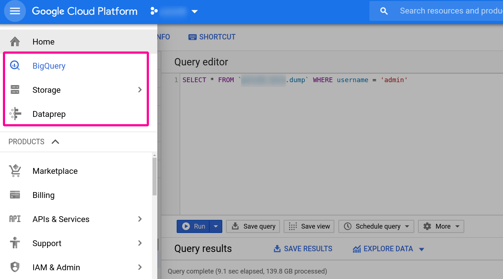
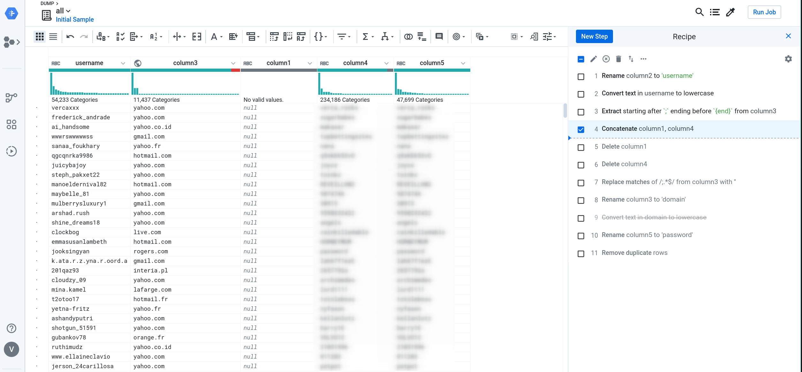

## THE RETCONNING

It is my sincerest hope that my last post was of some use to you because I'm about to tell you to
forget it. Like almost all of it. 

Right around the time I discovered that even with an O(log n) insertion rate,
and even while saturating the IO of 2 SSDs in a RAID-0 configuration
would seeding still take months... it was then, dear reader, that I decided...


Turns out that as the record count grew into the multiples of billions,
even b-tree indexes weren't going to be enough to maintain a reasonable ETA.
In my previous post, my math for detecting ETAs did not account for the fact that as the database grew,
so too would the time required to create the associations while seeding.

I took a few months off to tend to other projects. 
I'd come back every so often and just get overwhelmed at the sight of a `SELECT` here 
or a `JOIN` there. 
I eventually asked other red teamers if/what they were doing for password dump recon. 
Unanimously they answered, Google Cloud's BigQuery.

## ACT II



BigQuery, Dataprep, and Storage on GCP were my tools on this journey. 
Upon creating my account, I was welcomed with $300-worth of free credits. 
This ended up being just enough to upload, parse, and insert the dump data I had previously acquired.
The start of my journey began here: https://cloud.google.com/bigquery/docs/quickstarts/quickstart-command-line

With my account activated, I moved on to preparing my data, pulling out emails and
passwords from dumps using [ripgrep](https://github.com/BurntSushi/ripgrep).

```bash
rg --no-filename -a -o -f ./email.regex ../collections1-5/ >> all.txt
  # -a - reach into binary (non-text) data
  # -o - only print matches, not entire lines
  # -f [file] - a path to a file containing a regex pattern with which to match
```

This nasty piece of regex right here is what `ripgrep` will match while poring over the data:
```regex
(?i)(?:[a-z0-9!#$%&'*+/=?^_`{|}~-]+(?:\.[a-z0-9!#$%&'*+/=?^_`{|}~-]+)*|"(?:[\x01-\x08\x0b\x0c\x0e-\x1f\x21\x23-\x5b\x5d-\x7f]|\\[\x01-\x09\x0b\x0c\x0e-\x7f])*")@(?i)(?:(?:[a-z0-9](?:[a-z0-9-]*[a-z0-9])?\.)+[a-z0-9](?:[a-z0-9-]*[a-z0-9])?|\[(?:(?:25[0-5]|2[0-4][0-9]|[01]?[0-9][0-9]?)\.){3}(?:25[0-5]|2[0-4][0-9]|[01]?[0-9][0-9]?|[a-z0-9-]*[a-z0-9]:(?:[\x01-\x08\x0b\x0c\x0e-\x1f\x21-\x5a\x53-\x7f]|\\[\x01-\x09\x0b\x0c\x0e-\x7f])+)\])[:|;](?:[a-z0-9!\]\[<>@#\(\):$%&\\"'*+/=?^_`{|}~-]+(?:\.[a-z0-9!#$%&'*+/=?^_`{|}~-]+)*|"(?:[\x01-\x08\x0b\x0c\x0e-\x1f\x21\x23-\x5b\x5d-\x7f]|\\[\x01-\x09\x0b\x0c\x0e-\x7f])*")
```

Next, I needed to turn my extracted data into a CSV file for consumption by BigQuery. 
I needed to turn `user@domain.com:password` into `user,domain,password`.
You're most welcome to `sed | awk | grep | cut` your way into the Annals of Leet-dom, but I used
DataPrep.

BigQuery, while technically able to ingest CSV straight from your computer using the CLI client like so:

```bash
bq load --quote "" --allow_jagged_rows --field_delimiter tab --source_format CSV "${dataset_name}.${table_name}" "gs://${project_name}/all.csv"
```

I had an internet hiccup during upload and had to start over. RIP a portion of my $300 budget. 
If doing this again, I'd upload to Storage instead. 
Both BigQuery and Dataprep allow Storage buckets as sources.

```bash
gsutil -o GSUtil:parallel_composite_upload_threshold=40G cp all.txt "gs://${project_name}/"
  # -o [option] here will allow concurrent uploads
```

I popped on over to the Dataprep service and enjoyed the nice walk-through. 
When ready to get started, I imported my dataset from Storage and started massaging the data. 




I was pleasantly surprised when clicking 'Run Job', 
because I noticed the option to export the job results **directly** to BigQuery. 
So useful. 
My job took around 24 hours to run.

```
Stats for passdb
========================================
Bytes:   150057615285
Rows:    3658006353
Unique
  Usernames: 1164102376
  Domain:    27389067
  Password:  887268363
```

## Using BigQuery as my API's backend datastore

A while ago, I created https://github.com/audibleblink/passdb-backend to try to handle the parsing,
seeding, and routing of dump data. 
I've since removed all code related to my naive database dalliances.
I've also retrofitted the existing API code to use BigQuery as the data source.
After creating and scoping a Service Account on the 
[Credential Portal Page](https://console.cloud.google.com/apis/credentials),
it was just a matter of exporting the right environment variables (see: project readme) and I was
back to using my existing frontend; the joys of decoupled webapps :)

After starting my API server locally, I can navigate to https://alexflor.es/passdb-frontend
and start querying again as if no grief had ever befallen me! 

*rocking intensifies*

By the way, if you haven't had the chance to develop a front-end in Svelte.js, I highly recommend
it.


> The gear in the top right on the live site allows for setting the location of the API server


## Conclusion

I don't regret the learnings, and in fact, if someone had told me from the get-go to use GCP, my
hard-headed ass would probably still have tried to self-host. My main question was how much data
duplication there was. Asked and answered. 

It took my butting up against the well-established case of the space-time trade-off to be reminded 
that space is cheap, so like, who even cares?


PS: Wait a minute, now the data is parsed and organized, perhaps I can export the BigQuery tables and
self-host after all (_sans_ normalization, but oh well)! Time for an alternate branch!

