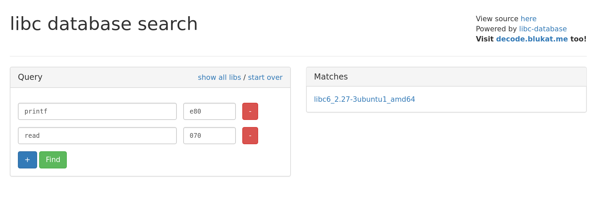

Do you like clean exploit scripts? Do you fidget with and refactor them long after you've submitted
the flag? If so, then this blog series is right up your alley!

At some point you'll be developing an exploit that requires you to return to some shared library,
most likely `libc`. Problem is there's a good chance the `libc` on your local dev box is not same
version as the one on the remote box. You may already know about the `libc` database [here on
GitHub](https://github.com/niklasb/libc-database). You'll have to leak a few addresses from the
remote box in order to be able to search for the right version.

You can also look up addresses on a webapp that uses the `libc` database as a backend.
https://libc.blukat.me/



Instead of keeping 2 sets of addresses and offsets (local and remote) you can use the `pwnlib.libcdb`
[Pwntool's module](http://docs.pwntools.com/en/stable/libcdb.html?highlight=libcdb#module-pwnlib.libcdb)

Once you've identified which `libc` is on the remote server, you can take its buildid or hash and
pop it into pwntools. Then you can start rop-chaining or symbol searching right from the comfort of 
your exploit script.

```python
leaked_got_read = leak_read()
exe = ELF('pwnable')

if "remote" not in sys.argv:
    libc = exe.libc
else:
    dl_libc = libcdb.search_by_md5("50390b2ae8aaa73c47745040f54e602f")
    libc = ELF(dl_libc)

libc_base = leaked_got_read  - libc.sym.read
```

Debug log output during script execution shows that pwntools is handling the file download and
caching for you.

First run:

```log
[DEBUG] Downloading data from LibcDB: https://gitlab.com/libcdb/libcdb/raw/master/hashes/md5/50390b2ae8aaa73c47745040f54e602f
[+] Downloading 'https://gitlab.com/libcdb/libcdb/raw/master/hashes/md5/50390b2ae8aaa73c47745040f54e602f': 70B

[DEBUG] Downloading data from LibcDB: https://gitlab.com/libcdb/libcdb/raw/master/libc/libc6_2.27-3ubuntu1_amd64/lib/x86_64-linux-gnu/libc-2.27.so
[+] Downloading 'https://gitlab.com/libcdb/libcdb/raw/master/libc/libc6_2.27-3ubuntu1_amd64/lib/x86_64-linux-gnu/libc-2.27.so': 1.94MB
```

Second run:
```log
[DEBUG] Found existing cached libc at '/home/red/.pwntools-cache/libcdb/md5/50390b2ae8aaa73c47745040f54e602f'
[*] Using cached data from '/home/red/.pwntools-cache/libcdb/md5/50390b2ae8aaa73c47745040f54e602f'
```

That's all for today's Pwntools quick tips!
