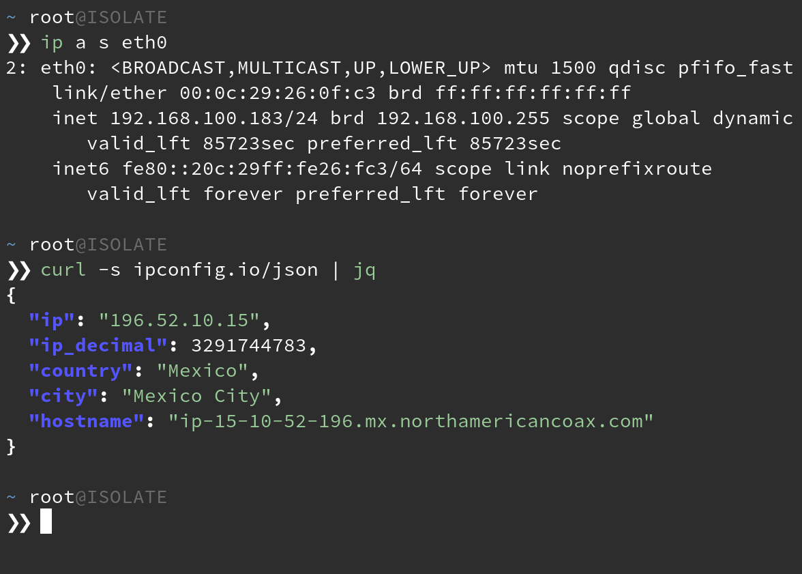

OPSEC is hard and those OOPS moments can often cost you a campaign when Red teaming. In this post
I'll go over how I set up my VMs so I never have to remember to turn on a VPN, stress about having
some 'killswitch' fail, or being on the losing end of some network-race-condition nonsense when
waking my laptop.


Automation isn't always about convenience for the user. Sometimes it's also about determinism. It's
about knowing that no matter what edge cases may or may not exist now, or in the future, they'll
have no bearing on your desired outcome. In this sense, we're talking about technology that works
_for_ you, without being in your way. You shouldn't even notice it's there until something is broken.

So let's move this problem "up the stack", so to speak. I'm not really sharing anything new here,
just putting it all in one place and talking about how to build it from scratch. In fact, this is
the exact way [Whonix](https://www.whonix.org/wiki/About#Security_by_Isolation) 
recommends you run their distribution; by using their Gateway VM.

Enough, so what are we talking about here? We're talking about creating a VM that acts as a
gateway, or router, for your attack VM. We'll use some `iptables` rules to ensure that any client
of our gateway can only communicate through the `tun0` interface. We'll also create a DHCP server
for your connecting clients, and of course, the VMWare settings to make all this possible. So let's
get started. 

I'll be using Debian for the gateway VM, but feel free to use any distro you like. They're all
perfectly capable.

I'll be using VMWare Workstation, but this works in most others too. 

Begin by creating your VM and assigning it 2 network interfaces in your virtualization software of
choice. One network can be NAT. To avoid complications, the other network should be a new one that
isn't used by other VMs. If you need to make a new network, some VM solutions have some sort of
virtual network manager in their settings.


Here, the NAT network will provide internet access to our gateway, allowing it to VPN out. The
other network will serve DHCP and internet to any guest OSes that happen to have the vmnet2
interface assigned by the virtualization software. More on that later.

Power on the gateway VM.

Note the output of `ip`

```bash
ip addr show # or 'ip a s' for short
```

In my case, I can see that `ens33` is the NAT interface because it pulled DHCP from VMWare's virtual
network. `ens36` has no IP because we haven't assigned it one, nor is there a DHCP server on the
`vmnet2` network. Continue by installing our dependencies.

```bash
sudo apt update
sudo apt install dnsmasq openvpn iptables-persistent openssh-server
```

SSH in.

You'll also need an account with a VPN provider that provides `*.ovpn` files. I'll be going with
Private Internet Access for this one.

This engagement requires we be located in Mexico.
Download the PIA VPN profiles to the gateway:

```bash
wget https://www.privateinternetaccess.com/openvpn/openvpn.zip
unzip -c openvpn.zip Mexico.ovpn > /etc/openvpn/client/Mexico.ovpn
```
Let's start by configuring the Debian to automatically start the VPN on boot. 

```bash
# Create a systemd unit that starts the tunnel on system start
#
cat <<FILE > /etc/systemd/system/openvpn.service
[Unit]
Description=Start VPN on boot
Requires=networking.service
After=networking.service

[Service]
User=root
Type=simple
ExecStart=/usr/sbin/openvpn --config Mexico.ovpn --auth-user-pass up.txt
WorkingDirectory=/etc/openvpn/client

[Install]
WantedBy=multi-user.target
FILE
```

Create the `up.txt` that holds your OpenVPN profile credentials:

```bash
# Create the auth file for autostarting the VPN tunnel
#
cat <<FILE > /etc/openvpn/client/up.txt
${your_ovpn_user}
${your_ovpn_pass}
FILE

chmod 400 /etc/openvpn/client/up.txt

# Recognize the changes by reloading the daemon and enable the unit
#
systemctl daemon-reload
systemctl enable openvpn.service
systemctl start openvpn.service
```

At this point, you should have a working VPN connection and a `tun0` interface when you run `ip a s`.
If you're following along, you should get `Mexico City` when you:

```bash
curl ipconfig.io/city
```

Next up, we enable IP forwarding on the kernel and set up our DHCP server. Feel free to change the
IP values so they suit your needs.

```bash
# Uncomment the setting that allows packet forwarding between network interfaces
#
sed -i "/net.ipv4.ip_forward=1/ s/#*//" /etc/sysctl.conf

# Configure the static address for the adapter serving DHCP
#
cat <<FILE > /etc/network/interfaces
source-directory /etc/network/interfaces.d
auto lo
iface lo inet loopback

auto ens33
iface ens33 inet dhcp

allow-hotplug ens36
iface ens36 inet static
    address 192.168.100.1
    netmask 255.255.255.0
    network 192.168.100.0
FILE

# Configure the DHCP server that will give our clients an IP
#
cat <<FILE > /etc/dnsmasq.conf
interface=ens36
bind-interfaces
dhcp-range=192.168.100.100,192.168.100.200,255.255.255.0,24h
FILE
```

Load the interface changes and restart dnsmasq and ensure it's running properly:

```bash
ifup ens36
systemctl restart dnsmasq
systemctl status dnsmasq
```

One last step, just set and save some `iptables` rules:

```bash
# Configure the firewall to redirect packets coming from the client net
# to leave through the VPN interface. Deny all but established
# connections coming from the tun0 interface. Persist the rules.
#
iptables -t nat -A POSTROUTING -s 192.168.100.0/24 -o tun0 -j MASQUERADE
iptables -A FORWARD -s 192.168.100.0/24 -o tun0 -j ACCEPT
iptables -A FORWARD -d 192.168.100.0/24 -m state --state ESTABLISHED,RELATED -i tun0 -j ACCEPT

mkdir /etc/iptables
iptables-save > /etc/iptables/rules.v4
```

Reboot the machine and SSH back in. You should see a `tun0` interface running and the output of
`ss -lupn` should show dnsmasq listening on `68/UDP`.

We're ready to connect a machine to our client network.

Head over to any existing VM and set its network adapter to the same secondary adapter you
connected to the gateway VM. In my case, that would be `vmnet2`.


Boot your VM and check that it's received a valid IP address in the range you specified.



Any machines to which you connect to the `vmnet2` network interface will be forced
through VPN without needing a client on the attack VM itself. Ensure that your attack VMs have only
this 1 network interface attached. If the gateway VM's VPN ever drops, you will cease to have
internet on the attack VM, preventing any background process from disclosing your real IP.

This ends up being a nice way to share VPN profiles between accounts as well. It's been pretty
useful to have both Windows and Linux machines on the HackTheBox network, for example.

There are plenty of solutions that let you point and click to achieve this same result. [OPNSense](https://opnsense.org/users/get-started/),
[PFSense](https://www.pfsense.org/), [PIA Tunnel](https://github.com/KaiserSoft/PIA-Tunnel) to name
a few. They may also serve your needs in this regard.
